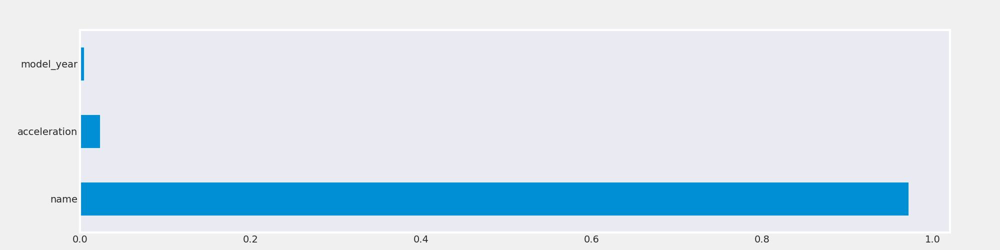

# Vehicle-Type-Prediction

Predicting Vehicle Type Prediction using machine learning models.

## Table of Contents
- [Installation](#installation)
- [Project Structure](#project-structure)
- [Data Source and Preprocessing](#data-source-and-preprocessing)
- [Model Details](#model-details)
- [Evaluation Metrics](#evaluation-metrics)
- [Results and Visualizations](#results-and-visualizations)
- [Acknowledgments](#acknowledgments)
- [Contact](#contact)

## Installation
Install the required packages from the `requirements.txt` file:

## Project Structure
The project is organized as follows:

- `Automobile/`: Contains raw data files.
- `automobile.ipynb/`: Holds Jupyter notebooks used for data analysis and exploration.
- `car_datas.pkl/`: Stores trained machine learning models for vehicle type prediction.
- `fast.py`: A Python script to make predictions using trained models.

## Data Source and Preprocessing
- The dataset is obtained from [Kaggle](https://www.kaggle.com/dataset).
- Preprocessed data by handling missing values and encoding categorical features.

## Model Details
- Trained a Random Forest Classifier and Gradient Boosting Classifier.

## Evaluation Metrics
- Evaluated models using Mean Absolute Error (MAE).

## Results and Visualizations

- Visualized feature importances for the Gradient Boosting Model.

## Acknowledgments
- Used the `scikit-learn` library for machine learning models.

## Contact
For questions or feedback, contact me at adefemiadeyanju101@hotmail.com.

